# NadiCTF Writeups

Step-by-step challenge notes by adump, with the original screenshots kept in reading order.

## Challenges

- [Suspicious Download](#suspicious-download)
- [The Corrupted Disk Image](#the-corrupted-disk-image)
- [Meridian Vault System 1](#meridian-vault-system-1)
- [Meridian Vault System 2](#meridian-vault-system-2)
- [Meridian Vault System 3](#meridian-vault-system-3)
- [Legacy Access](#legacy-access)
- [The Careless Developer](#the-careless-developer)

[Download the original Word writeup](../originals/NadiCTF-Writeup.docx)

## Suspicious Download

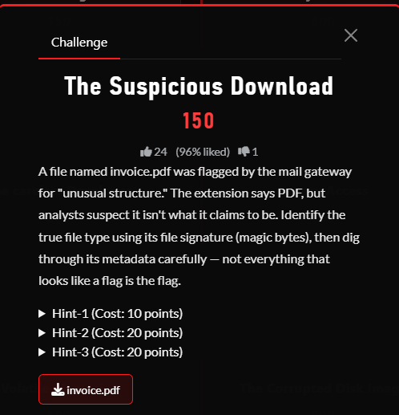

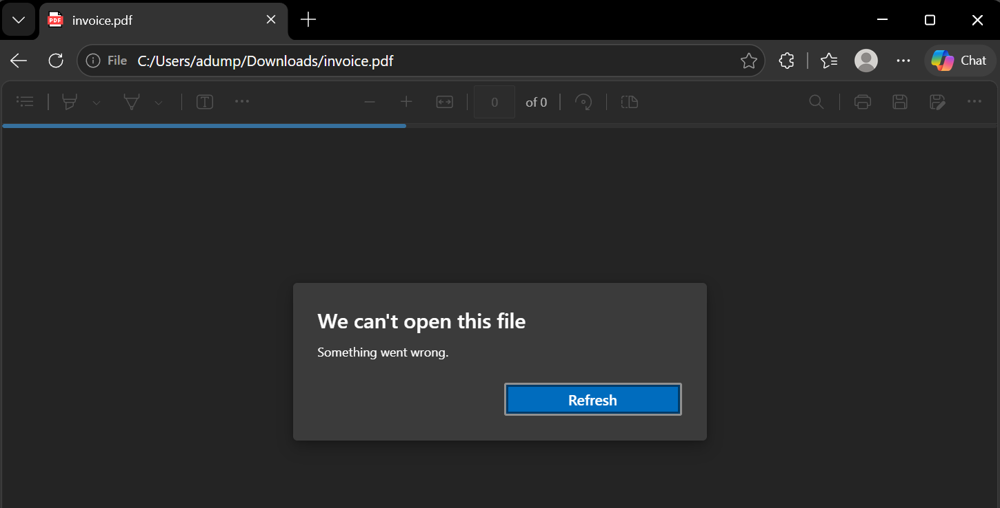

- The chall files given cant be opened

- Chall desc hinted that we need to dig through metadata.

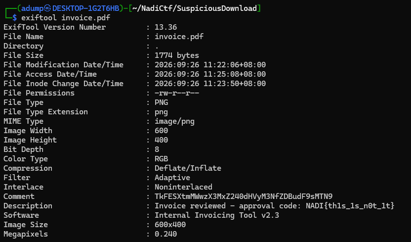

- Found the fake flag and strings I don’t know what type of cipher

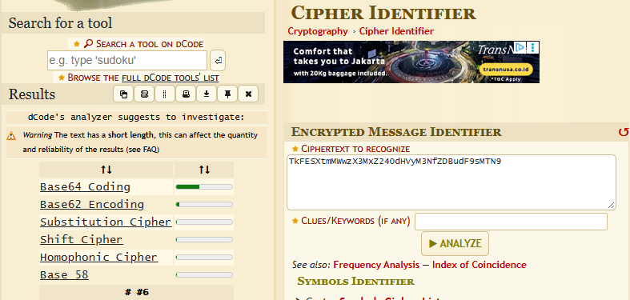

- After tested with Cipher Identifier found out that the strings shown are Base64 Strings

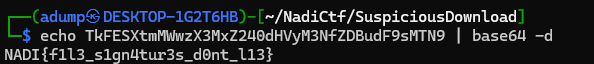

- Decrypted the strings and boom found the flag

**Flag:** `NADI{f1l3_s1gn4tur3s_d0nt_l13}`

## The Corrupted Disk Image

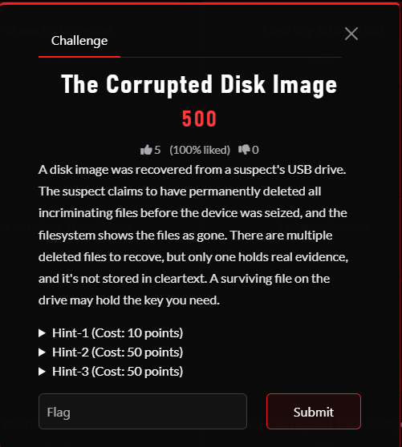

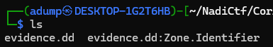

- Successfully downloaded the challenge files ( thanks to admin )

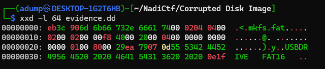

- Shown mkfs.fat proved created by Linux mkfs

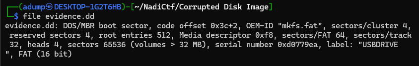

- file says: FAT (16 bit)

- Conclusion: This is a FAT16 filesystem, not corrupted at the boot sector level.

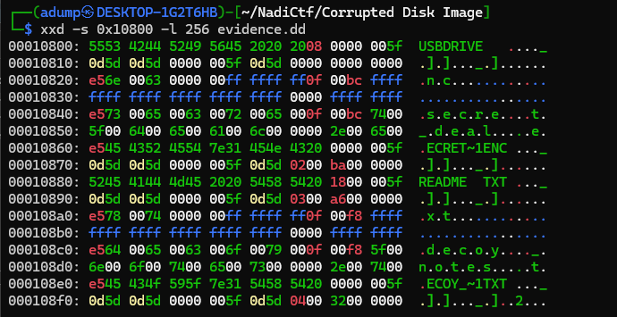

- Reading the root directory at 0x10800 reveals 8 entries. The first byte 0xE5 marks deleted files — FAT deletion only replaces the first character of the filename and frees the FAT chain, but the directory entry metadata (cluster + size) and the actual file data remain intact. This is why "deleted doesn't mean destroyed."

- Three recoverable files identified:

| File | Status | Cluster | Size | Role |
| --- | --- | --- | --- | --- |
| README.TXT | Active | 3 | 166 | Key source |
| secret.txt.enc (LFN) / SECRET~1.ENC | Deleted | 2 | 186 | Encrypted vault |
| decoy_notes.txt (LFN) / DECOY_~1.TXT | Deleted | 4 | 50 | Fake flag |

- The LFN entries (attribute 0x0F) sit directly above their matching 8.3 entries and store the long filename in UTF-16LE — reading the fragments reconstructs secret... and decoy_notes.txt.

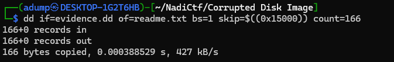

- Extracted cluster 2

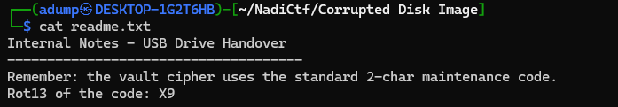

- Read readme.txt and found hint to ROT13 code X9

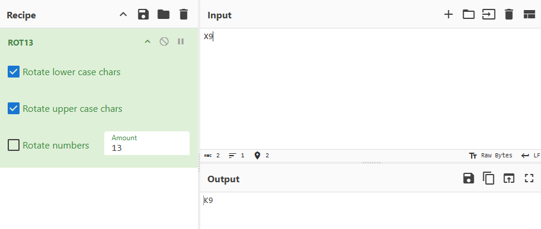

- Got K9 as the expected key

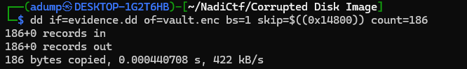

- Extracted Cluster 3 ( vault.enc )

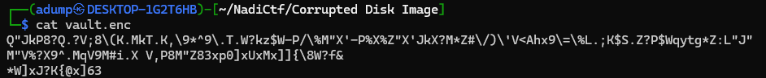

- The data found  is high-entropy binary — no readable strings, no known file magic. This confirms the challenge hint that the evidence is "not stored in cleartext." The .ENC extension and the README's mention of a "vault cipher" point to encryption. Since the key is only 2 characters, the most likely cipher is repeating-key XOR

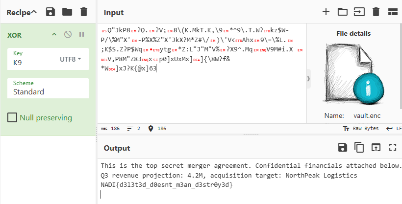

- Xored the data using key K9 and boom found the flag !

**Flag:** `NADI{d3l3t3d_d0esnt_m3an_d3str0y3d}

Optional :`

- Extracted Cluster 4 ( decoy.txt )

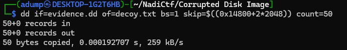

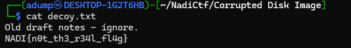

- Since the notes says to ignore I decided to ignore it

## Meridian Vault System 1

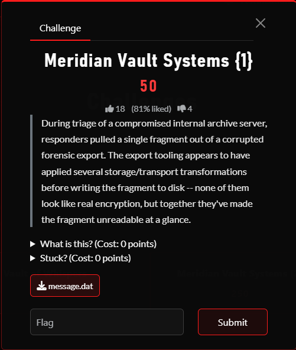

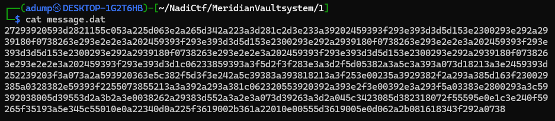

### Step 1: Recognize hexadecimal

### The beginning of message.dat looks like

27293920593d2821155c053a225d063e...

### Every character is one of

0 1 2 3 4 5 6 7 8 9 a b c d e f

It also has an even number of characters after removing the final newline. Those are strong signs that the file contains hexadecimal text.

### Decode it with

```text
data = bytes.fromhex(encoded_text)
```

The result is still unreadable, meaning another transformation remains.

### Step 2: Identify the single-byte XOR

The decoded bytes are concentrated in a limited range and contain repeated patterns. This suggests every byte may have been XORed with the same value.

Trying all 256 possible XOR values shows that 0x6C produces text containing only valid Base64 characters:

KEUL5QDMy0iVN1jRFJ1XFNVQDpAROVUL...

### Apply it with

```text
xor_result = bytes(byte ^ 0x6C for byte in data)
```

### Why XOR can be reversed this way

```text
encrypted_byte = original_byte XOR 0x6C
```

### Applying the same XOR again gives

encrypted_byte XOR 0x6C

= original_byte XOR 0x6C XOR 0x6C

= original_byte

### This works because

0x6C XOR 0x6C = 0

### Step 3: Reverse the text

Although the XOR result uses valid Base64 characters, decoding it directly produces meaningless binary data.

### Inspecting its ending reveals

...SEFkT

### Reversing that gives

TkFES...

### TkFES is a believable Base64 prefix. It decodes to the beginning of

NADI...

### Therefore, reverse the entire XOR result

```text
reversed_text = xor_result[::-1]
```

### Step 4: Base64 decode

### Now decode the reversed text

```text
plaintext = base64.b64decode(reversed_text)
```

```python
import base64

with open("message.dat", "r") as file:
    encoded = file.read().strip()

# Layer 1: hexadecimal
data = bytes.fromhex(encoded)

# Layer 2: single-byte XOR
xor_result = bytes(byte ^ 0x6C for byte in data)

# Layer 3: reverse the Base64 text
reversed_base64 = xor_result[::-1]

# Layer 4: Base64
plaintext = base64.b64decode(reversed_base64)

print(plaintext.decode())
```

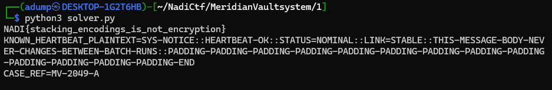

- This reveal the flag : NADI{stacking_encodings_is_not_encryption}

## Meridian Vault System 2

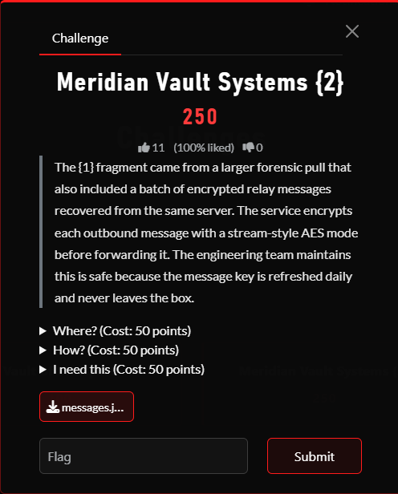

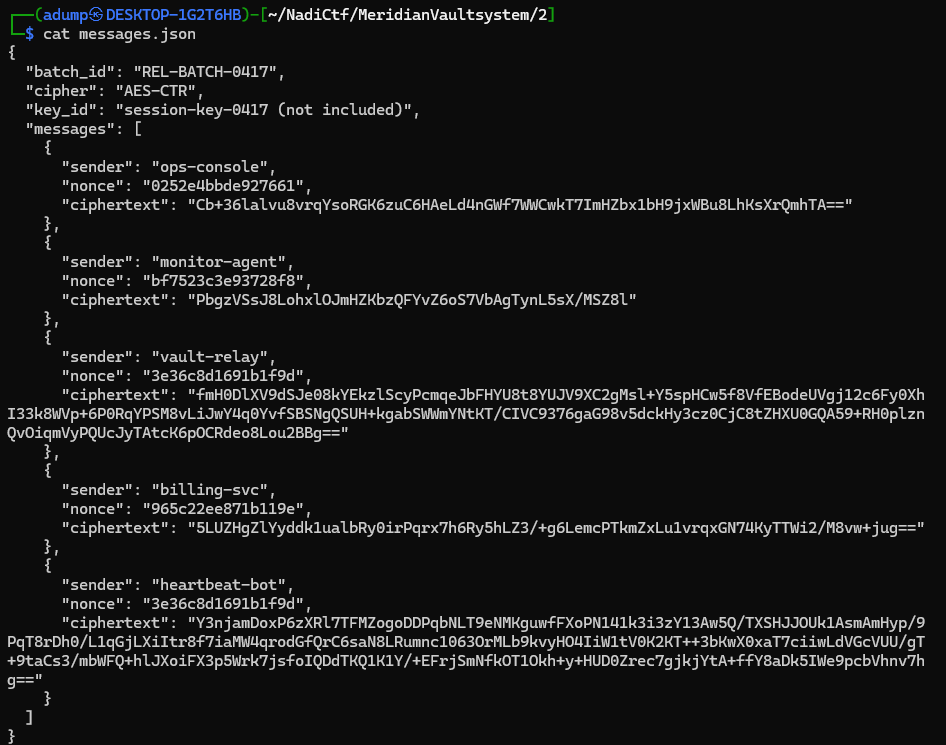

- From the content of the chall files :

### The encryption mode is AES-CTR

"cipher": "AES-CTR"

### All messages belong to the same batch and use the same session key

"batch_id": "REL-BATCH-0417"

"key_id": "session-key-0417"

The actual key is not included, but we do not need it for the attack.

The ciphertext values are Base64 representations of encrypted bytes. Base64 itself is not encryption.

### Most importantly, two messages have the same nonce

vault-relay:   3e36c8d1691b1f9d

heartbeat-bot: 3e36c8d1691b1f9d

- Because they use the same AES key and nonce, AES-CTR generates the same keystream for both messages.

```python
import base64
import json

with open("messages.json", "r") as file:
    data = json.load(file)

# Find the two messages that share a nonce.
vault_message = next(
    message
    for message in data["messages"]
    if message["sender"] == "vault-relay"
)

heartbeat_message = next(
    message
    for message in data["messages"]
    if message["sender"] == "heartbeat-bot"
)

print("Vault nonce:", vault_message["nonce"])
print("Heartbeat nonce:", heartbeat_message["nonce"])

# Convert the Base64 strings into actual ciphertext bytes.
vault_ciphertext = base64.b64decode(
    vault_message["ciphertext"]
)

heartbeat_ciphertext = base64.b64decode(
    heartbeat_message["ciphertext"]
)

# Plaintext recovered from Part 1.
heartbeat_plaintext = (
    b"SYS-NOTICE::HEARTBEAT-OK::STATUS=NOMINAL::"
    b"LINK=STABLE::"
    b"THIS-MESSAGE-BODY-NEVER-CHANGES-BETWEEN-BATCH-RUNS::"
    b"PADDING-PADDING-PADDING-PADDING-PADDING-PADDING-"
    b"PADDING-PADDING-PADDING-PADDING-PADDING-PADDING-"
    b"PADDING-END"
)

# C_vault XOR C_heartbeat XOR P_heartbeat
vault_plaintext = bytes(
    vault_byte ^ heartbeat_byte ^ known_byte
    for vault_byte, heartbeat_byte, known_byte
    in zip(
        vault_ciphertext,
        heartbeat_ciphertext,
        heartbeat_plaintext
    )
)

print(vault_plaintext.decode())
```

- Saved it as xoratt.py and execute it

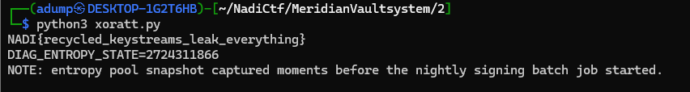

- Boom we found the flag !

**Flag:** `NADI{recycled_keystreams_leak_everything}`

## Meridian Vault System 3

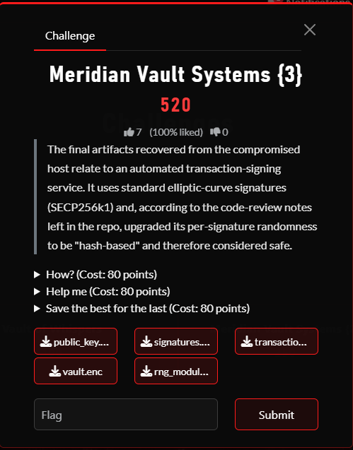

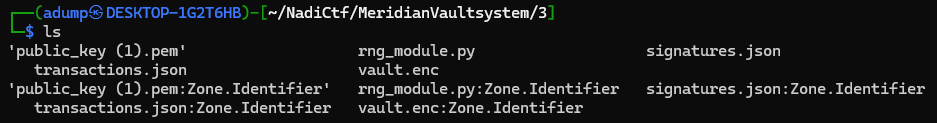

- Successfully Downloaded the chall files

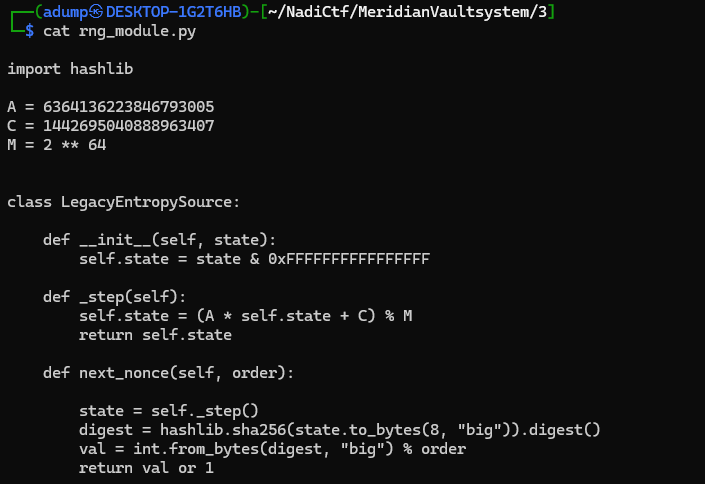

- Inspecting rng.py first

- The important function performs:

self.state = (A * self.state + C) % M

- This is a predictable linear congruential generator.

- It then produces the ECDSA nonce by hashing the state:

```text
digest = hashlib.sha256(state.to_bytes(8, "big")).digest()
```

```text
val = int.from_bytes(digest, "big") % order
```

- Inspecting the transactions

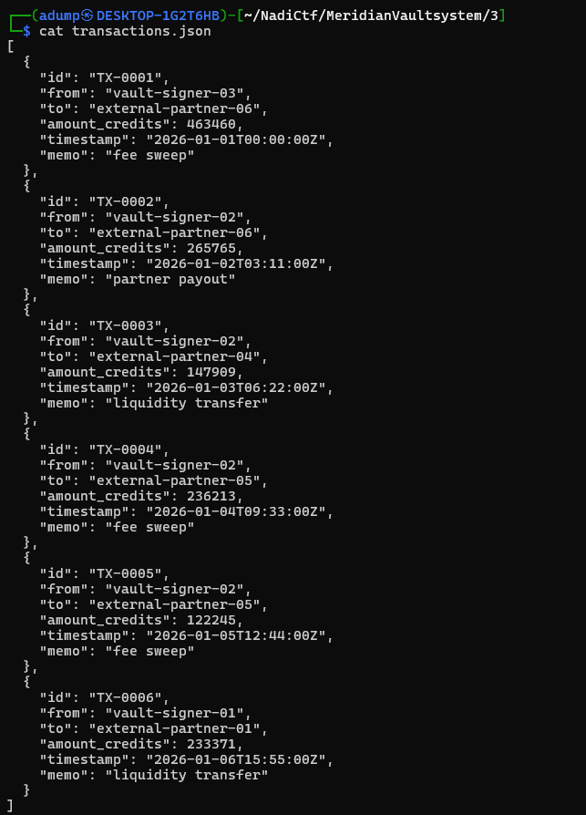

- Inspecting the signatures

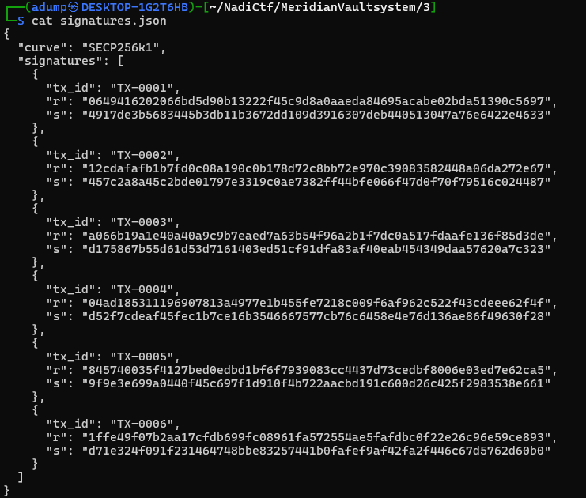

- Inspect the public key

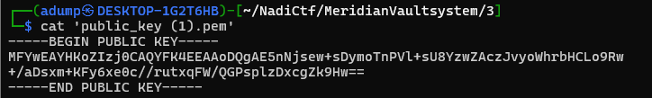

- What happened mathematically?

- The ECDSA signature equation is:

```text
s = k^-1 × (z + r × d) mod N
```

- We know:

- r and s from signatures.json

- z from hashing TX-0001

- k because the RNG state leaked in Part 2

- N because SECP256k1’s order is public

- Only the private key d remains unknown.

- Rearranging gives:

```text
d = (s × k - z) × r^-1 mod N
```

- Once d is recovered, the challenge derives an AES key using:

- AES key = SHA256(private_key_as_32_bytes)

- That key decrypts vault.enc

```python
import hashlib
import json

from cryptography.hazmat.primitives import serialization
from cryptography.hazmat.primitives.asymmetric import ec
from cryptography.hazmat.primitives.ciphers.aead import AESGCM


# SECP256k1 group order
N = 0xFFFFFFFFFFFFFFFFFFFFFFFFFFFFFFFEBAAEDCE6AF48A03BBFD25E8CD0364141

# Constants copied from rng_module.py
A = 6364136223846793005
C = 1442695040888963407
M = 2**64

# State recovered from Meridian Vault Systems {2}
state = 2724311866


# -------------------------------------------------
# Step 1: Reproduce the first ECDSA nonce
# -------------------------------------------------

# next_nonce() advances the state before hashing it
state = (A * state + C) % M

state_bytes = state.to_bytes(8, "big")
nonce_digest = hashlib.sha256(state_bytes).digest()

k = int.from_bytes(nonce_digest, "big") % N

if k == 0:
    k = 1

print("[+] Updated RNG state:")
print(state)

print("\n[+] Reproduced ECDSA nonce k:")
print(hex(k))


# -------------------------------------------------
# Step 2: Load the first transaction
# -------------------------------------------------

with open("transactions.json", "r") as file:
    transactions = json.load(file)

transaction = transactions[0]

print("\n[+] Selected transaction:")
print(transaction)


# -------------------------------------------------
# Step 3: Recreate the signed transaction bytes
# -------------------------------------------------

message = json.dumps(
    transaction,
    sort_keys=True,
    separators=(",", ":")
).encode()

print("\n[+] Canonical transaction:")
print(message.decode())

message_digest = hashlib.sha256(message).digest()
z = int.from_bytes(message_digest, "big")

print("\n[+] Transaction hash z:")
print(hex(z))


# -------------------------------------------------
# Step 4: Load the corresponding signature
# -------------------------------------------------

with open("signatures.json", "r") as file:
    signature_data = json.load(file)

signature = signature_data["signatures"][0]

assert signature["tx_id"] == transaction["id"]

r = int(signature["r"], 16)
s = int(signature["s"], 16)

print("\n[+] Signature r:")
print(hex(r))

print("\n[+] Signature s:")
print(hex(s))


# -------------------------------------------------
# Step 5: Recover the ECDSA private key
# -------------------------------------------------

# ECDSA:
# s = k^-1 * (z + r*d) mod N
#
# Rearranged:
# d = (s*k - z) * r^-1 mod N

private_value = (
    (s * k - z) * pow(r, -1, N)
) % N

private_bytes = private_value.to_bytes(32, "big")

print("\n[+] Recovered private key:")
print(private_bytes.hex())


# -------------------------------------------------
# Step 6: Verify it against the supplied public key
# -------------------------------------------------

recovered_private_key = ec.derive_private_key(
    private_value,
    ec.SECP256K1()
)

recovered_public_numbers = (
    recovered_private_key
    .public_key()
    .public_numbers()
)

with open("public_key (1).pem", "rb") as file:
    supplied_public_key = serialization.load_pem_public_key(
        file.read()
    )

supplied_public_numbers = supplied_public_key.public_numbers()

if recovered_public_numbers == supplied_public_numbers:
    print("\n[+] Public key verification succeeded")
else:
    raise ValueError("Recovered key does not match public key")


# -------------------------------------------------
# Step 7: Derive the AES-256 key
# -------------------------------------------------

aes_key = hashlib.sha256(private_bytes).digest()

print("\n[+] Derived AES key:")
print(aes_key.hex())


# -------------------------------------------------
# Step 8: Read and split vault.enc
# -------------------------------------------------

with open("vault.enc", "rb") as file:
    encrypted = file.read()

# First 12 bytes are the AES-GCM nonce
aes_nonce = encrypted[:12]

# Remaining bytes contain ciphertext and GCM tag
ciphertext_and_tag = encrypted[12:]

print("\n[+] AES-GCM nonce:")
print(aes_nonce.hex())

print("\n[+] Ciphertext and tag length:")
print(len(ciphertext_and_tag))


# -------------------------------------------------
# Step 9: Decrypt the vault
# -------------------------------------------------

plaintext = AESGCM(aes_key).decrypt(
    aes_nonce,
    ciphertext_and_tag,
    None
)

print("\n[+] Decrypted vault:")
print(plaintext.decode())
```

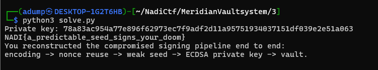

- Boom we got the flag

**Flag:** `NADI{a_predictable_seed_signs_your_doom}`

## Legacy Access

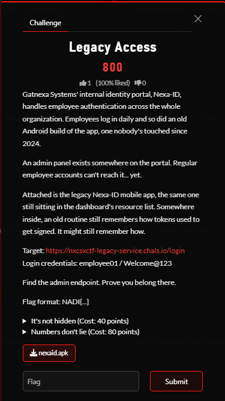

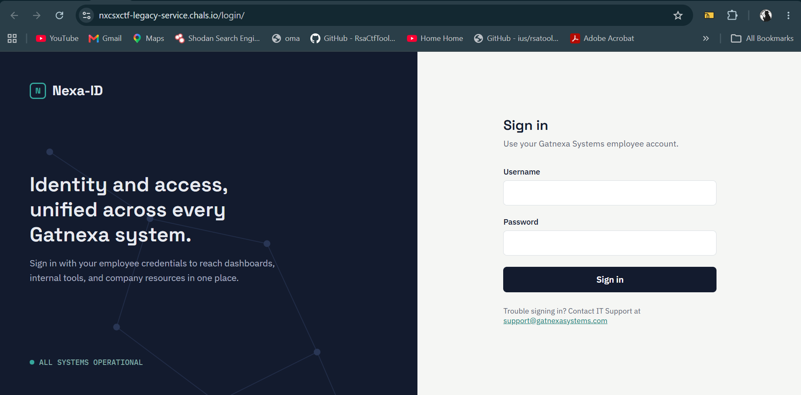

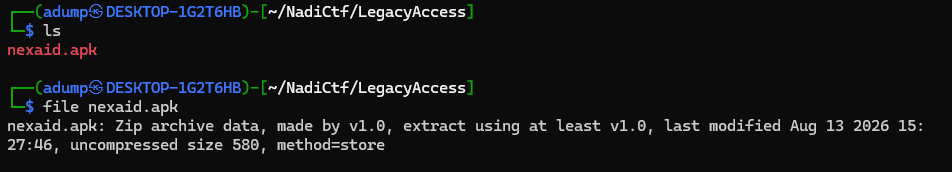

- Downloaded the attachment  and inspected the target

- Hint: "An old routine still remembers how tokens used to get signed."

### Strategy 

- Find the endpoint

- Analyze how the authentication worked for the website

- Strike Admin Panel

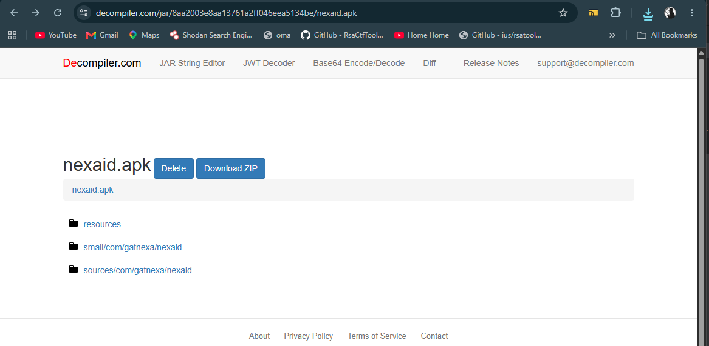

- Decompile the apk using Decompiler.com

- Successfully decompiled and saved it locally

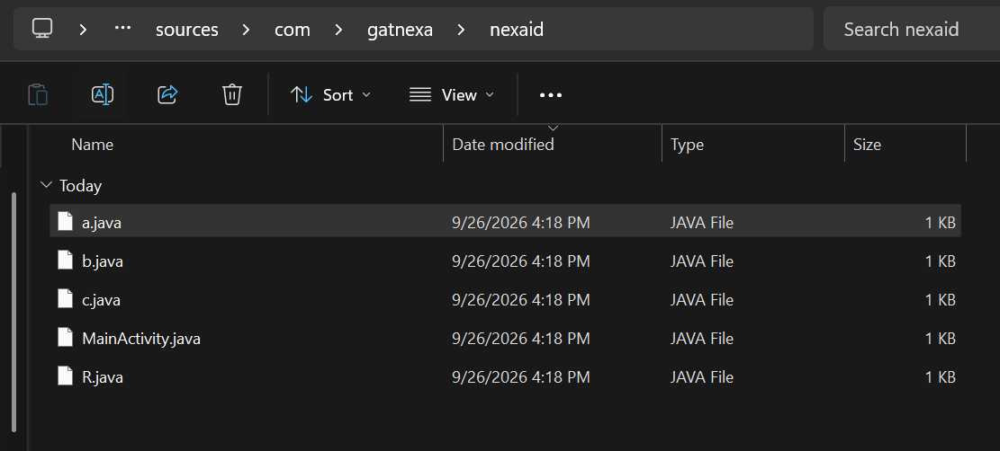

- Found the main sources use to ran this apk

Mainactivity.java

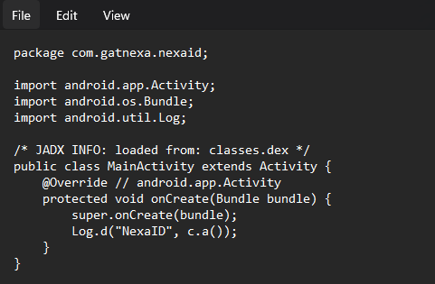

R.java

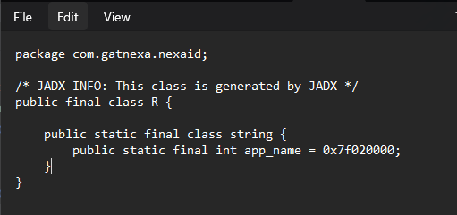

a.java

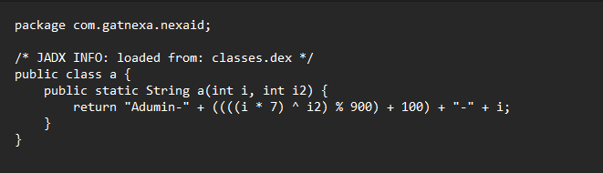

b.java

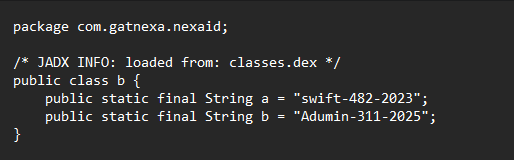

c.java

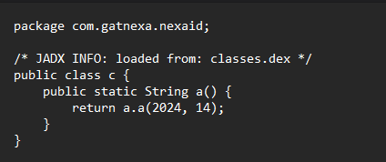

- The pattern: Adumin-<number>-<year> — this family of strings is how tokens used to get signed. The typo "Adumin" is the fingerprint.

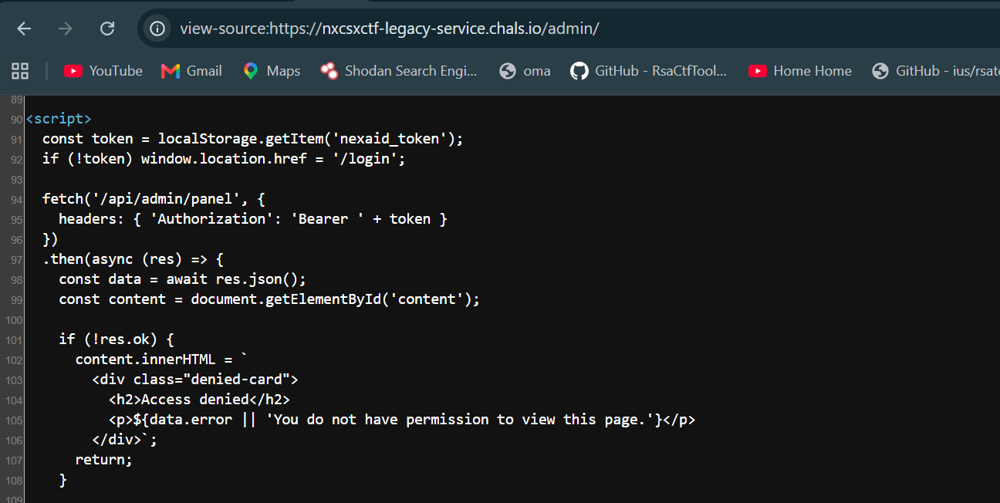

- Found how authorization works and endpoint for admin panel

- Target: GET /api/admin/panel with a Bearer token. Flag is in the JSON response.

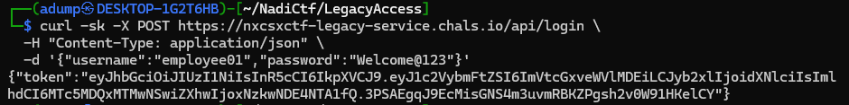

- Steals the employee01 jwt token

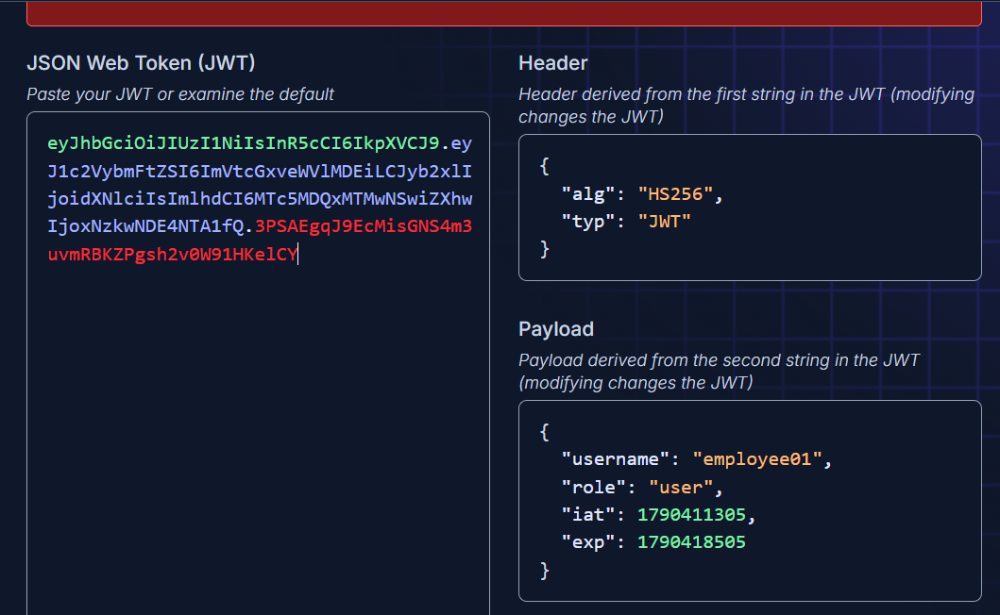

- Decode it and found the payload

- Now we need to crack the jwt secret with the APK formula

### Cracker Script 

```python
import hmac, hashlib, base64, sys

def b64url(b): return base64.urlsafe_b64encode(b).rstrip(b'=').decode()

token = sys.argv[1]
header, payload, target = token.split('.')
si = f"{header}.{payload}".encode()

cands = set()
for y in range(2019, 2027):
    for salt in range(0, 200):
        cands.add(f"Adumin-{(((y*7)^salt)%900)+100}-{y}")
for w in ("swift","Swift","Admin","admin","Adumin","nexaid","NexaID"):
    for y in range(2019, 2027):
        for n in range(100, 1000):
            cands.add(f"{w}-{n}-{y}")

for s in cands:
    if b64url(hmac.new(s.encode(), si, hashlib.sha256).digest()) == target:
        print("SECRET:", s)
        break
else:
    print("no match")
```

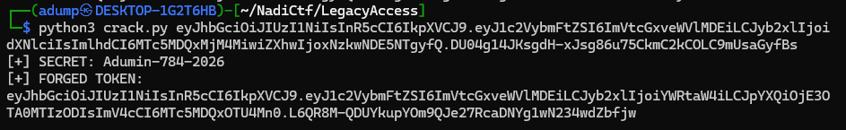

- Successfully match and forged the token for Adumin-784-2026

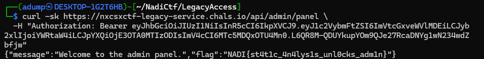

- Boom Successfully retrieve the flag from admin panel

**Flag:** `NADI{st4t1c_4n4lys1s_unl0cks_adm1n}`

## The Careless Developer

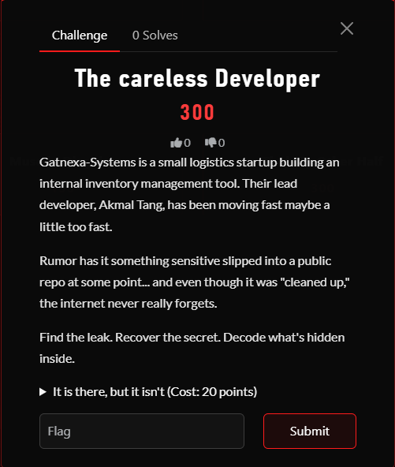

- The challenge desc highly hint for typical ctf challenge for Forensic git which is recover previous commits content

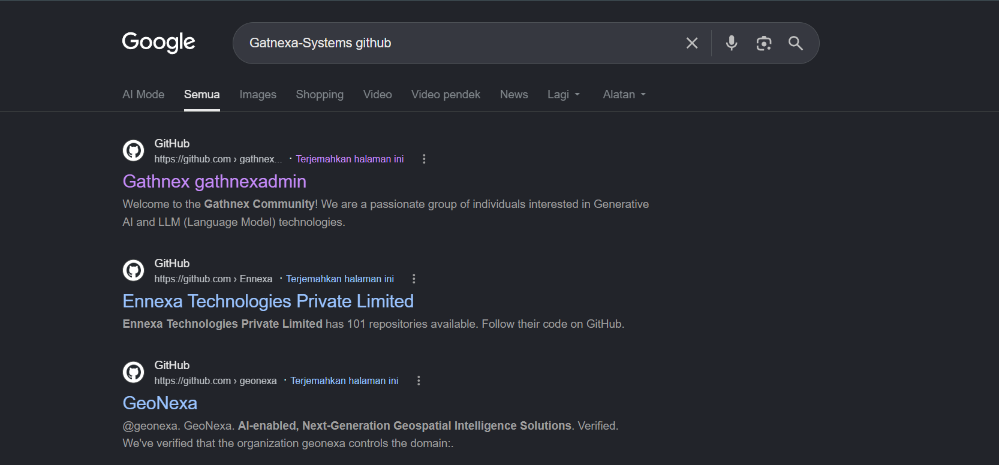

- I don’t found the organization name for Gatnexa-Systems github as I expected

- I suspected the organization / repo is not indexed by google search

- Then I decided try to search using github url and using lowercase letters

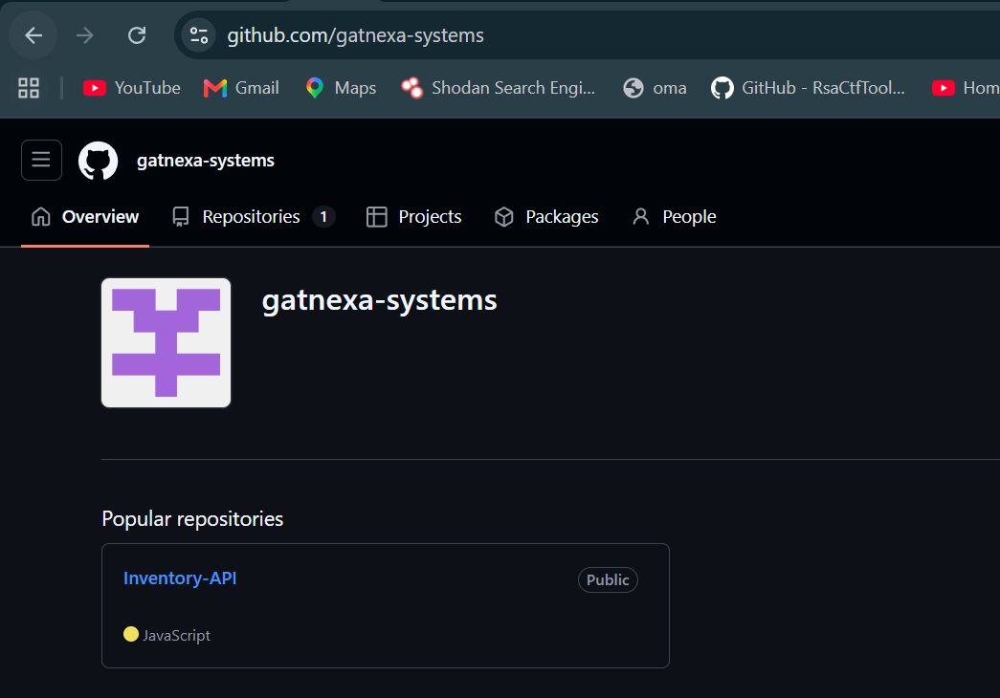

- Boom found gatnexa-systems organization git

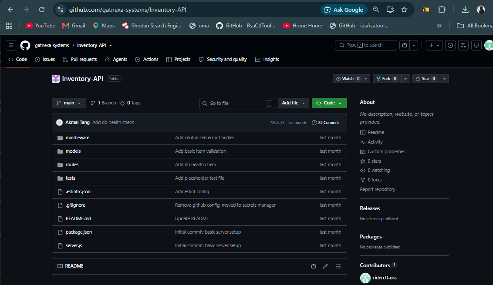

- Found the repo created by Gatnexa-Systems

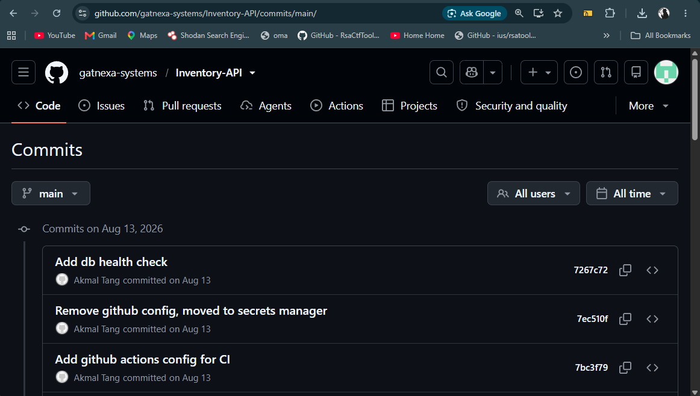

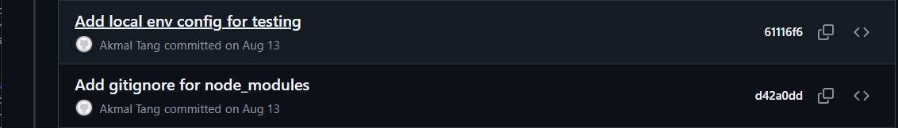

- Found the suspected commit

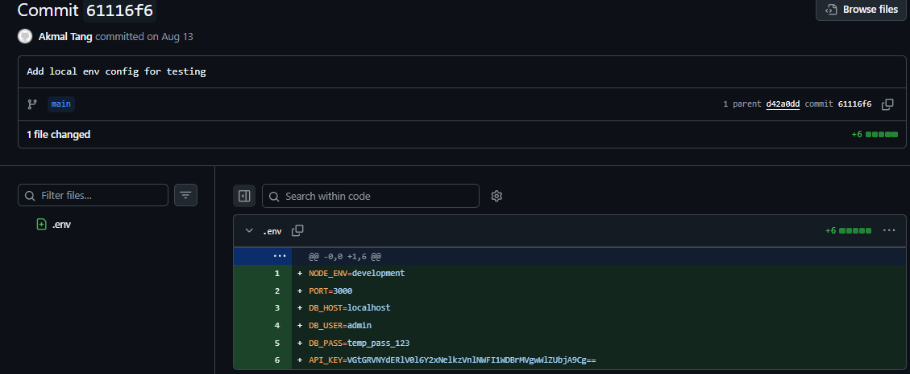

- Found API key exposed in base64 strings

- After repeated base64 decodes

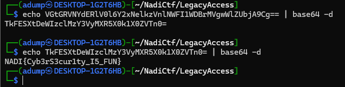

- Boom found the flag

**Flag:** `NADI{Cyb3rS3cur1ty_I5_FUN}`
