# PicoCTF Writeups

Step-by-step challenge notes by adump, with the original screenshots kept in reading order.

## Challenges

- [Riddle Registry](#riddle-registry)
- [Log Hunt](#log-hunt)
- [Hidden in Plain Sight](#hidden-in-plain-sight)
- [Flag in Flame](#flag-in-flame)

[Download the original Word writeup](../originals/Pico-CTF-Writeup.docx)

## Notes

- Environment: Kali Linux through Windows Subsystem for Linux
- AI tools were used while solving some challenges

## Riddle Registry

The challenge provides a PDF that looks ordinary but hints that the useful information is hidden in its metadata.

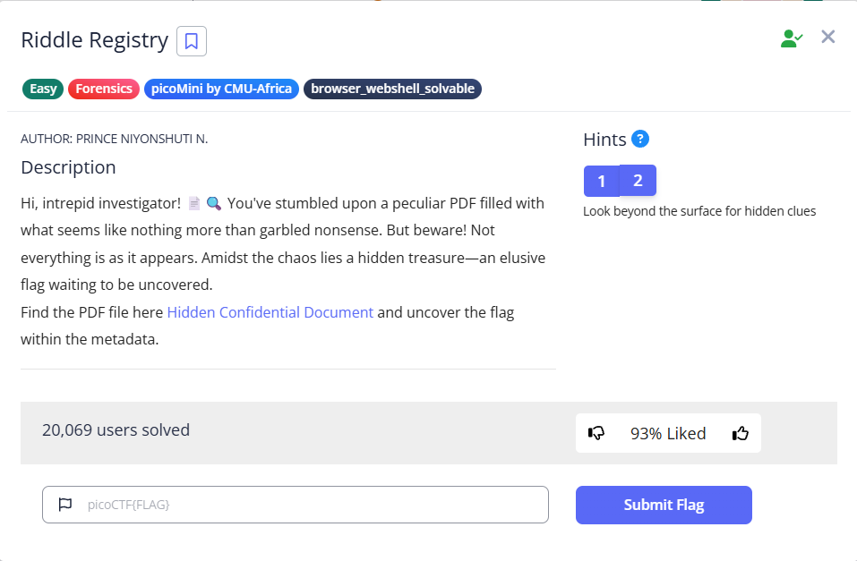

### Solution

1. Copy the PDF download link from the challenge page.

   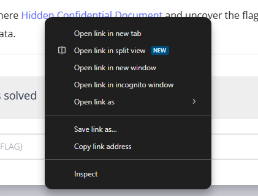

2. Download the file with `wget` and save it as `confidential.pdf`.

   ```bash
   wget <challenge-file-url> -O confidential.pdf
   ```

   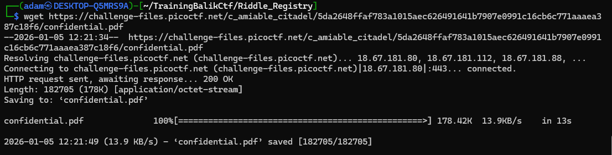

3. Confirm that the download is a PDF, then inspect its metadata with `pdfinfo`.

   ```bash
   file confidential.pdf
   pdfinfo confidential.pdf
   ```

4. The `Author` field contains a Base64-encoded value. Decode that value to recover the flag.

   ```bash
   echo 'cGljb0NURntwdXp6bDNkX20zdGFkYXRhX2YwdW5kIV9jMjA3MzY2OX0=' | base64 -d
   ```

   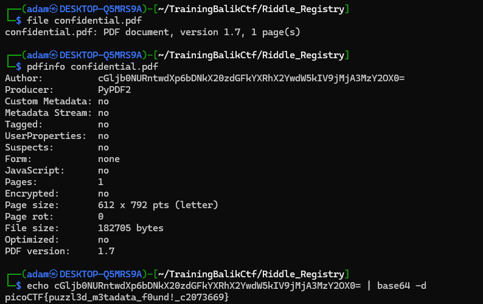

**Flag:** `picoCTF{puzzl3d_m3tadata_f0und!_c2073669}`

## Log Hunt

The server log contains repeated flag fragments mixed with normal log messages. The goal is to identify the fragments and reconstruct their original order.

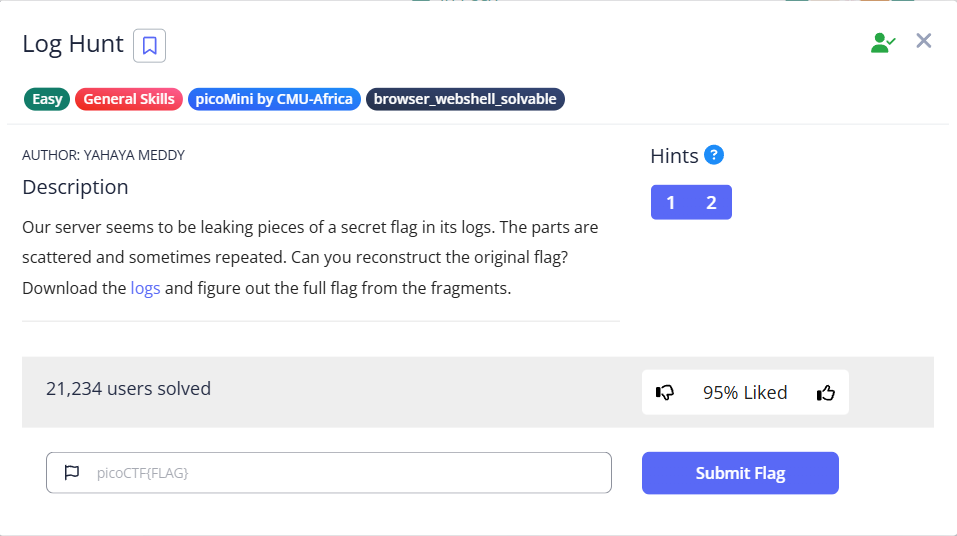

### Solution

1. Download the supplied log file.

   ```bash
   wget <challenge-file-url> -O server.log
   ```

   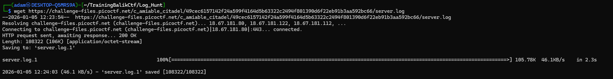

2. Check the file type. It is ordinary ASCII text, so it can be inspected with standard text tools.

   ```bash
   file server.log
   ```

   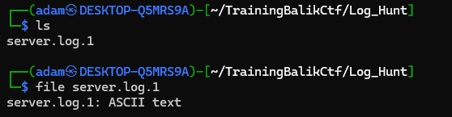

3. Reading the file reveals entries labelled `INFO FLAGPART`. Each entry contains one piece of the flag.

   ```bash
   cat server.log
   ```

   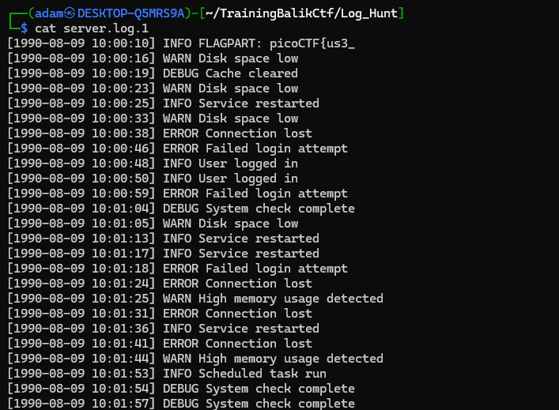

4. Filter the log to show only the flag fragments. The same values appear repeatedly, so keep the first occurrence of each new fragment and join them in order:

   - `picoCTF{us3_`
   - `y0urlinux_`
   - `sk1lls_`
   - `cedfa5fb}`

   ```bash
   grep 'INFO FLAGPART' server.log
   ```

   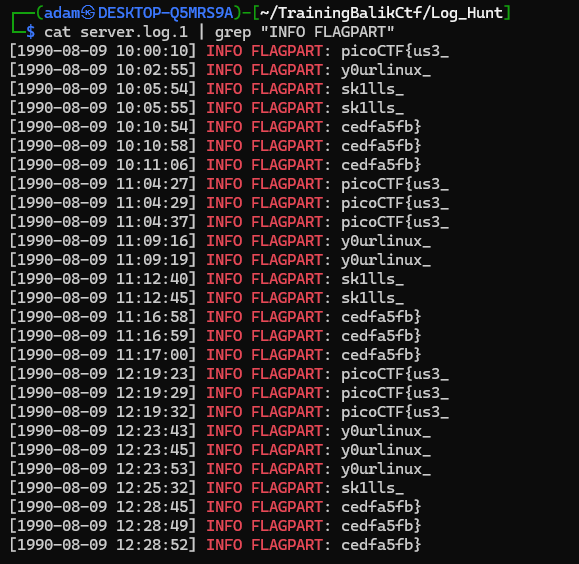

**Flag:** `picoCTF{us3_y0urlinux_sk1lls_cedfa5fb}`

## Hidden in Plain Sight

The supplied JPEG displays normally, but its metadata contains a clue for extracting data hidden inside the image.

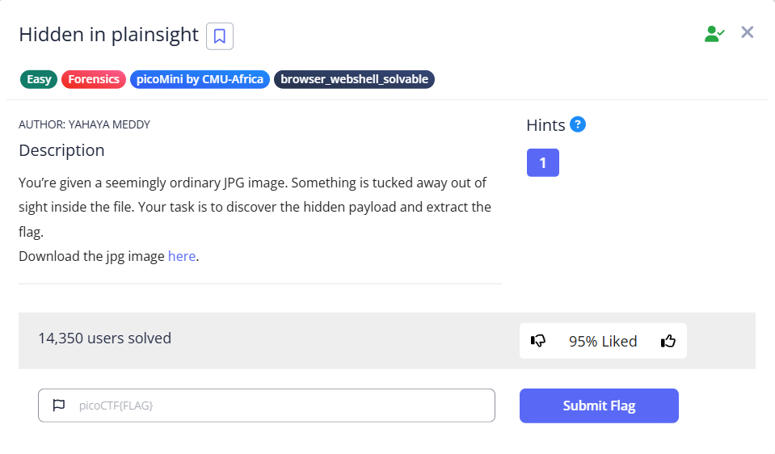

### Solution

1. Download the JPEG as `img.jpg`.

   ```bash
   wget <challenge-file-url> -O img.jpg
   ```

   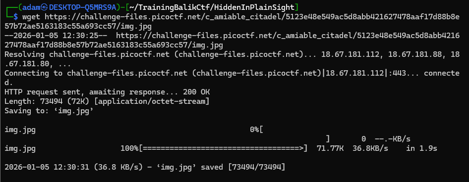

2. Opening the image does not reveal anything obvious, so inspect its metadata instead.

   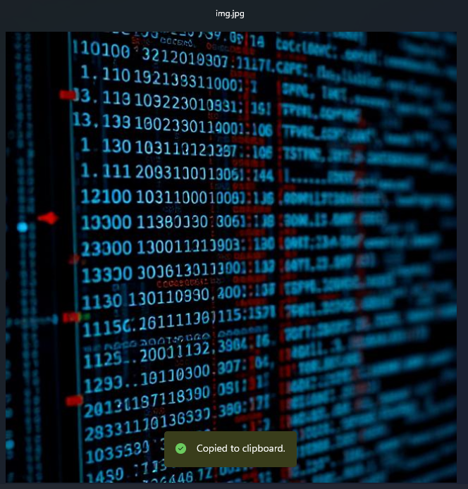

3. Run `exiftool`. The `Comment` field contains the Base64 value `c3RlZ2hpZGU6Y0VGNmVuZHZjbVE9`.

   ```bash
   exiftool img.jpg
   ```

   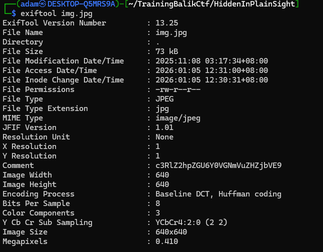

4. Decode the comment. It produces a `steghide` clue and the passphrase `pAzzword`.

   ```bash
   echo 'c3RlZ2hpZGU6Y0VGNmVuZHZjbVE9' | base64 -d
   echo 'cEF6endvcmQ=' | base64 -d
   ```

5. Extract the hidden file with `steghide`, enter the recovered passphrase, and read `flag.txt`.

   ```bash
   steghide extract -sf img.jpg
   cat flag.txt
   ```

   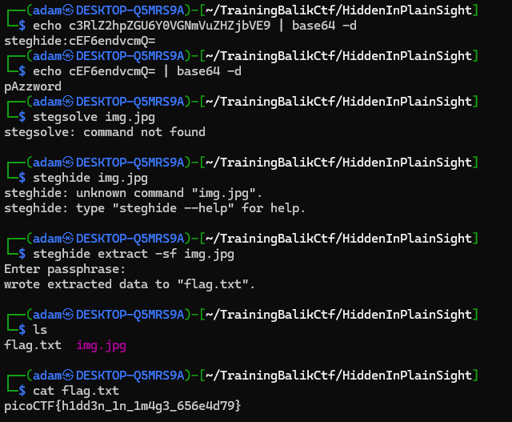

**Flag:** `picoCTF{h1dd3n_1n_1m4g3_656e4d79}`

## Flag in Flame

The challenge supplies a very large line of encoded text. The hint indicates that the data should first be decoded from Base64 to recreate an image.

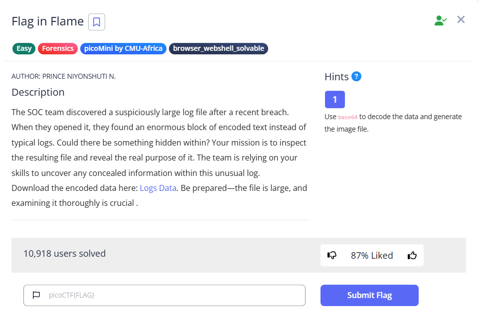

### Solution

1. Download the encoded log data.

   ```bash
   wget <challenge-file-url> -O logs.txt
   ```

   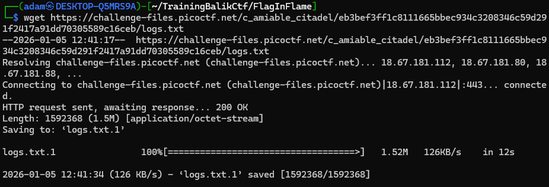

2. The `file` command reports ASCII text with one extremely long line, which is consistent with Base64 data.

   ```bash
   file logs.txt
   ```

   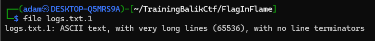

3. Decode the text and save the binary output.

   ```bash
   base64 -d logs.txt > output
   ```

   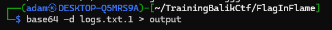

4. The output is an image. Rename it with a `.png` extension and open it.

   ```bash
   mv output output.png
   open output.png
   ```

   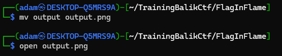

   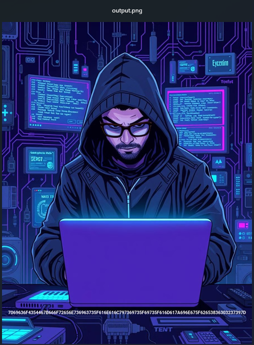

5. A hexadecimal string appears along the bottom of the image. Copy it into CyberChef and apply the **From Hex** recipe. The decoded text in the screenshot begins with `picoCTO`; change the final `O` to `F` to match the required `picoCTF{...}` flag format.

   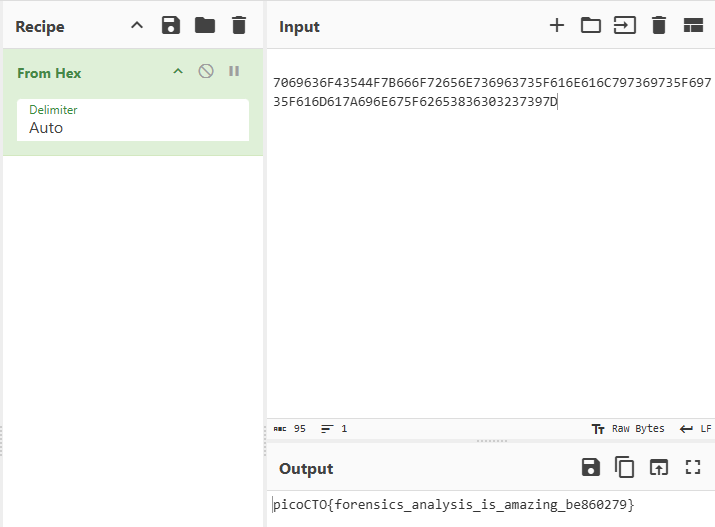

**Flag:** `picoCTF{forensics_analysis_is_amazing_be860279}`
